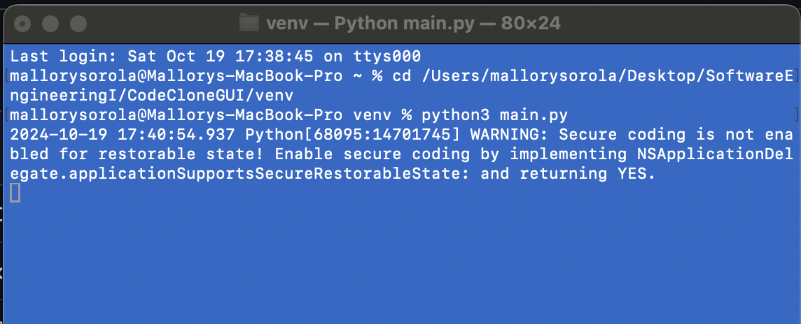
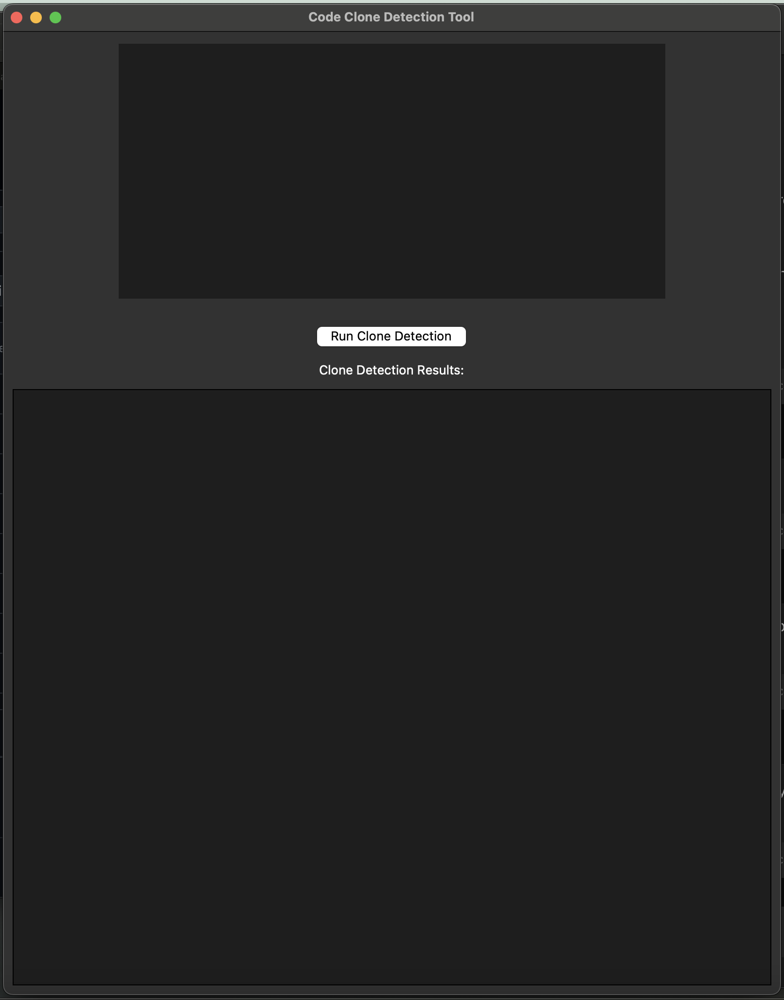

# Code Clone Detection Tool

# Description
The Code Clone Detection Tool is designed to identify and eliminate duplicate or similar code segments in Python and Java projects. It supports three types of clones:

Type 1: Exact matches of code.                          
Type 2: Renamed variables but structurally identical code.                    
Type 3: Modified code with retained structural similarities.

This tool provides a user-friendly interface to detect clones, generate reports, and help developers refactor redundant code. The tool can handle large codebases efficiently and is built to support a wide range of projects.

# Features
Clone Detection: Identifies Type 1, 2, and 3 code clones in Python and Java.        
GUI Interface: Provides a simple graphical interface to navigate through the code clones.
Refactoring Suggestions: Helps developers refactor duplicate code.                  
Clone Reports: Generates detailed reports of detected clones.

# Installation
1. Clone the repository in terminal
2. Navigate to the project directory in terminal
3. Install necessary dependencies in terminal

# Running the tool
1. Open project in your preferred IDE
2. Run the main file to start GUI
3. Use Open Codebase option to load your Python or Java project
4. Run Code Clone Detection to identify code clones

# Contributers
Demetrio Deanda (@ddean09) - Collaborator                                          
Mallory Sorola (@MalloryAnn) - Collaborator

